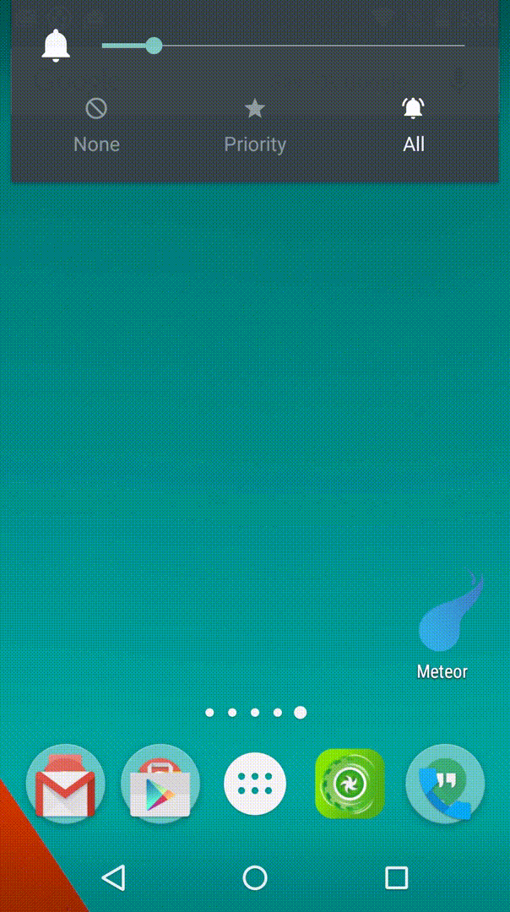

# CutinAppSupport


 

This is the development kit to create CUT-IN Apps work with CUT-IN Manager.

Try out the sample app on the [Google Play](https://play.google.com/store/apps/details?id=com.garlicg.sample.cutinappsupport).

# Quick Start For Android Studio

This tutorial is the following configurations:

- `CutinEngine` with simple animation using ic-launcher.
- `CutinService` to controll `CutinEngine`.
- `CutinPanel UI` works with the CUT-IN Manager.

 

After the tutorial, you can improve CUT-INs by adding `CutinEngine` as sample app.


1. New Project
--

Create a new android project with choosing "Add No Activity".


2. Write build.gradle
--

```groovy

dependencies {
    compile 'com.android.support:appcompat-v7:21.1.1'
    compile 'com.garlicg:cutin-app-support:3.0.4'
}

```


3. Add permission to AndroidManifest.xml
--

```xml

<uses-permission android:name="android.permission.SYSTEM_ALERT_WINDOW" />
```


4. Create CutinEngine with simple animation
--

`CutinEngine` is abstract class to set layout and show animation. You must to call `finishCutin()` when animation end.

SampleEngine.java

```java

public class SampleEngine extends CutinEngine{

    public SampleEngine(CutinService cutinService) {
        super(cutinService);
    }

    private ImageView mImageView;

    @Override
    public View onCreateLayout(Context context) {
        LayoutInflater inflater = LayoutInflater.from(context);
        View root = inflater.inflate(R.layout.engine_sample , null);
        mImageView = (ImageView)root.findViewById(R.id.image);
        return root;
    }

    @Override
    public void onStart() {
        int centerX = mImageView.getWidth()/2;
        int centerY = mImageView.getHeight()/2;

        // Rotate a second.
        RotateAnimation rotate = new RotateAnimation(0, 1170 , centerX , centerY);
        rotate.setDuration(1000);
        rotate.setAnimationListener(new Animation.AnimationListener() {
            @Override
            public void onAnimationStart(Animation animation) {
            }

            @Override
            public void onAnimationRepeat(Animation animation) {
            }

            @Override
            public void onAnimationEnd(Animation animation) {
                // must finish cutin when end of anim.
                finishCutin();
            }
        });

        mImageView.startAnimation(rotate);
    }
}
```

layout/engine_sample.xml

```xml 

<?xml version="1.0" encoding="utf-8"?>
<FrameLayout xmlns:android="http://schemas.android.com/apk/res/android"
    android:layout_width="match_parent"
    android:layout_height="match_parent">

    <ImageView
        android:id="@+id/image"
        android:layout_width="wrap_content"
        android:layout_height="wrap_content"
        android:layout_gravity="center"
        android:src="@drawable/ic_launcher" />

</FrameLayout>
```


5. Create CutinService to controll CutinEngine
--

SampleService.java

```java

public class SampleService extends CutinService {

    public static final long ORDER_SAMPLE = 0;  

    @Override
    protected CutinEngine onCreateEngine(Intent intent, long orderId) {
        if(orderId == ORDER_SAMPLE){
            return new SampleEngine(this);
        }
         // can define other engine if need
        else {
        }
        
        // stop service immediately and show nothing.
        return null;
    }
}
``` 


AndroidManifest.xml

```xml

<service
    android:name=".SampleService"
    android:icon="@drawable/ic_launcher">
    <intent-filter>
        <!-- action name must to be full path of Service Class -->
        <action android:name="yourpackage.SampleService" />
    </intent-filter>
</service>
```


6. Create CutinPanel UI
--

`SimpleCutinPanel` is subclass of `android.app.Activity`. It has feature belows

- Light and Dark Panel Theme depends on CUT-IN Manager Theme.
- Registration `CutinService`, `title` , and `orderId` to the CUT-IN Manager.
- Controll CUT-IN Demo playback.


SamplePanel.java

```java

public class SamplePanel extends SimpleCutinPanel{

    @Override
    protected void onCreateCutins(CutinScreen cutinScreen) {
        ArrayList<CutinItem> items = new ArrayList<>();

        // serviceClass , title , order id 
        items.add(new CutinItem(SampleService.class, "Sample" , SampleService.ORDER_SAMPLE);
        // can add other CUT-IN
        // items.add(new CutinItem(SampleService.class, "Other", 1);

        cutinScreen.setCutinList(items);
    }
}
```


AndroidManifest.xml

```xml
<activity
    android:name=".SamplePanel"
    android:exported="true"
    android:theme="@style/CutinPanel"
    android:label="@string/app_name" >

    <!-- for CUT-IN Manager -->
    <intent-filter>
        <action android:name="com.garlicg.cutin.action.PICK" />
        <category android:name="com.garlicg.cutin.category.RESOURCE" />
        <category android:name="android.intent.category.DEFAULT" />
    </intent-filter>
</activity>

<!-- For main launcher.
        if you want to hide launcher icon , set android:enabled = false -->
<activity-alias
    android:name=".LauncherActivityAlias"
    android:enabled="false"
    android:targetActivity=".SamplePanel">
    <intent-filter>
        <action android:name="android.intent.action.MAIN" />
        <category android:name="android.intent.category.LAUNCHER" />
    </intent-filter>
</activity-alias>
```

7. Confirmation
--

Launch the CUT-IN Manager and confirm to register and play CUT-IN.


# Tips of creating Settings Activity 

You can create Settings Activity (or Fragment) without using CutinPanel.


Return a CUT-IN to the CUT-IN Manager
--

```java

Intent intent = new Intent();
intent.putExtra(ManagerUtils.EXTRA_CUTIN_ACTION, cutinServiceClass.getName()); // String
intent.putExtra(ManagerUtils.EXTRA_CUTIN_TITLE, cutinTitle); // String
intent.putExtra(ManagerUtils.EXTRA_ORDER_ID, orderId); // long
setResult(Activity.RESULT_OK, intent);
finish();
```


Get current CUT-IN Manager theme.
--

```java
int cmTheme = getIntent().getIntExtra(ManagerUtils.EXTRA_THEME_UI , ManagerUtils.THEME_UI_LIGHT);
```
type | value | description
--- | --- | ---
int | ManagerUtils.THEME_UI_LIGHT | Light theme
int | ManagerUtils.THEME_UI_DARK | Dark theme


Confirm the presence using ManagerUtils class.
--

return | method | description
--- | --- | ---
boolean | isCalledFromManager(Intent getIntent) | This Activity called from the CUT-IN Manager or not.
boolean | existManager(Context context) | CUT-IN Manager is installed in the device or not.
Intent | buildMarketIntent() | Intent for view the CUT-IN Manager page on market.


Preparing Demo playback
--

```
private Demo mDemo;

@Override
protected void onCreate(Bundle savedInstanceState) {
    super.onCreate(savedInstanceState);
    mDemo = new Demo(context);
}
```

Demo Playback
--

```java
mDemo.play(cutinServiceClass , orderId)

```

```java
mDemo.forceStop()

```


# Proguard

```
-dontwarn com.garlicg.cutinsupport.**
```


# API Level

CutinAppSupport works on API level 10+.


# License


    Copyright 2015 Takahiro GOTO

    Licensed under the Apache License, Version 2.0 (the "License");
    you may not use this file except in compliance with the License.
    You may obtain a copy of the License at

       http://www.apache.org/licenses/LICENSE-2.0

    Unless required by applicable law or agreed to in writing, software
    distributed under the License is distributed on an "AS IS" BASIS,
    WITHOUT WARRANTIES OR CONDITIONS OF ANY KIND, either express or implied.
    See the License for the specific language governing permissions and
    limitations under the License.

