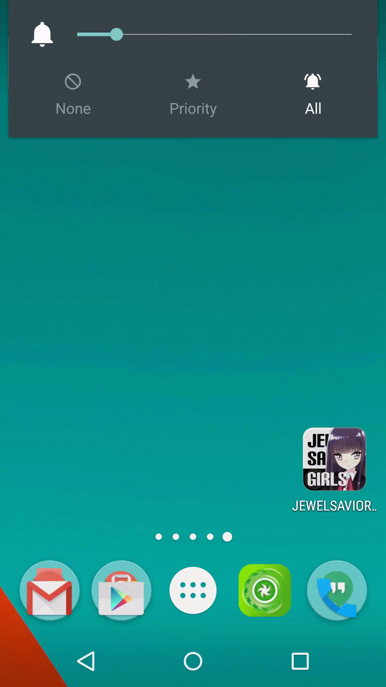

CutinManagerPlugin
======================

Definition
--

- CUT-IN : Momentary animation of about 1000-2000ms. 

CUT-IN Manager
--

The [CUT-IN Manager app](https://play.google.com/store/apps/details?id=com.garlicg.cutin) supports to show CUT-IN in response to various triggers.

CUT-IN App Plugin
--

[CutinAppSupport](https://github.com/garlicG/CutinManagerPlugin/tree/master/CutinAppSupport) is the development kit to create CUT-IN Apps.

Trigger Extension Plugin
--

[CutinTriggerExtension](https://github.com/garlicG/CutinManagerPlugin/tree/master/CutinTriggerExtension) is the development kit to add extention trigger to the CUT-IN Manager.

Apps
-- 

Please [send me](mailto://ggarlicg@gmail.com) information or create a pull request if you want to add a link into the CUT-IN Manager.

CUT-IN Apps

Icon | Name | Developer
--- | --- | ---
 | Garlin | GarlicBetterRices
 
Trigger Extensions

Icon | Name | Developer
--- | --- | ---
 | Alarm Trigger | GarlicBetterRices

API Level
--

CUT-IN Manager and Plugins work on API level 10+.

Contents license
--

Some images are from Jewel Savior.
> JewelSaviorFree 
> [http://www.jewel-s.jp/](http://www.jewel-s.jp/)
