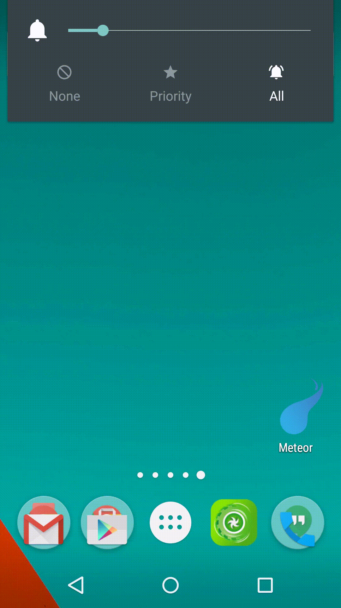
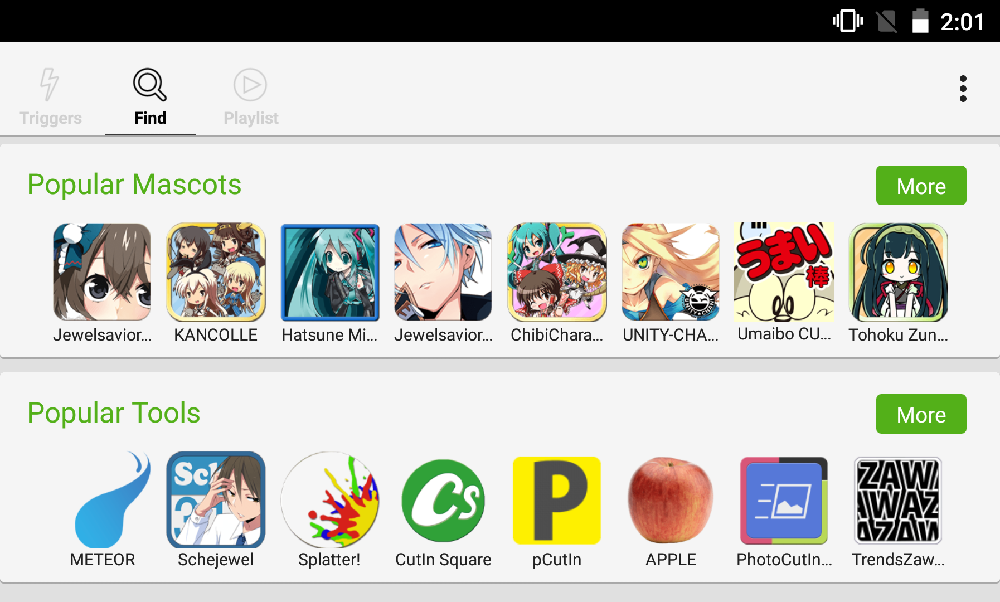

CutinManagerPlugin
======================

Definition
--

- CUT-IN : Momentary animation of about 1000-2000ms. 
- CUT-IN App: A plugin app for display CUT-INs.

CUT-IN Manager
--

> character image is from "JewelSaviorFree" http://www.jewel-s.jp/

The [CUT-IN Manager](https://play.google.com/store/apps/details?id=com.garlicg.cutin) supports to show CUT-IN in response to various triggers.

CUT-IN App Plugin
--

[CutinAppSupport](https://github.com/garlicG/CutinManagerPlugin/tree/master/CutinAppSupport) is the development kit to create CUT-IN Apps.

Trigger Extension Plugin
--

[CutinTriggerExtension](https://github.com/garlicG/CutinManagerPlugin/tree/master/CutinTriggerExtension) is the development kit to add extention trigger to the CUT-IN Manager.

App Links 
-- 

The CUT-IN Manager has free link area for plugins. Please create issue include following information if you want to add:

- Icon of app(144px*144px)
- Name of app
- URL of google play

Issue sample is [here](https://github.com/garlicG/CutinManagerPlugin/issues/17).

API Level
--

CUT-IN Manager and plugins work on API level 10+.
